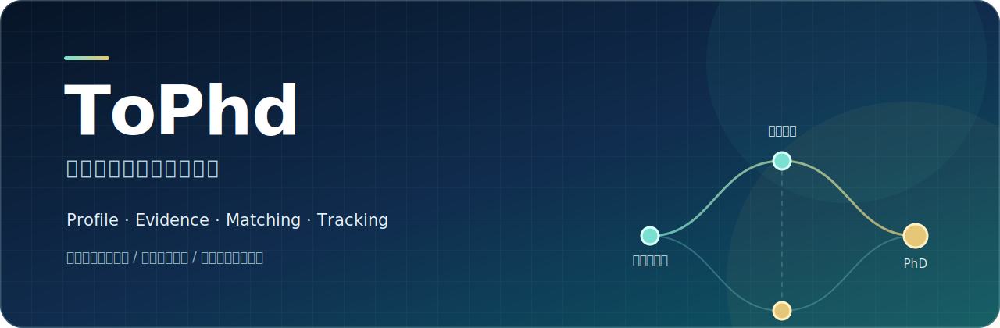
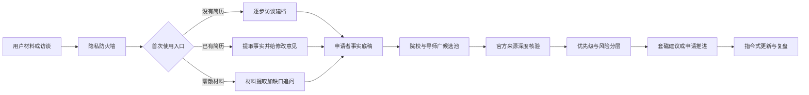

<div align="center">



<p>
  <kbd>Codex Skill</kbd>
  <kbd>中国大陆申博</kbd>
  <kbd>Privacy-first</kbd>
  <kbd>Evidence-based</kbd>
</p>

**从零建立申请者画像，筛选院校与导师，核验招生信息，并把复杂的申博过程变成一条可追踪、可复盘的工作流。**

`ToPhd` 是一个面向中国大陆高校与科研院所博士申请的 Codex Skill，服务对象以硕士生和第一次接触申博的申请者为主。

[功能概览](#功能概览) · [快速开始](#快速开始) · [使用示例](#使用示例) · [隐私防火墙](#隐私防火墙) · [路线图](#路线图)

</div>

---

## 为什么做 ToPhd

申博不是一次填表，而是一组相互依赖的长期决策：

- 我是否已经具备申请条件？
- 没有简历时从哪里开始？
- 有简历时应该先修改，还是重新制作？
- 哪些院校、专业和导师真正匹配？
- 导师研究方向匹配，是否等于当年一定招生？
- 招生简章、学院细则和导师主页发生冲突时相信谁？
- 如何避免把在投论文、项目贡献和研究结果写得失真？
- 如何持续更新信息，而不被公众号和经验帖带偏？

ToPhd 将这些问题组织为一个分阶段工作流：先建立事实档案，再做院校与导师筛选，最后基于官方证据推进联系和申请。

> ToPhd 不替代个人判断，也不承诺录取结果。它的目标是减少信息差、重复劳动和事实错误。

## 功能概览

| 模块 | 能力 | 当前状态 |
|---|---|---|
| 首次使用分流 | 区分“没有简历”“已有简历”“只有旧简历或零散材料” | 稳定 |
| 申请者建档 | 从教育、科研、论文、项目、技能、英语和申请目标建立事实底稿 | 稳定 |
| 简历处理 | 已有简历默认只给建议；明确要求后才原文修改或套用模板生成 | 稳定 |
| 院校与导师候选池 | 同时覆盖专业对口与专业扩展方向，支持约 80–120 条候选项 | 稳定 |
| 官方信息核验 | 区分学校简章、学院通知、专业目录、导师主页和第三方线索 | 稳定 |
| 单导师评估 | 分析研究匹配、招生不确定性、联系价值、风险和套磁切入点 | 稳定 |
| 指令式情报更新 | 仅在用户输入更新指令时核验官网、通知和公开平台线索 | 稳定 |
| 隐私防火墙 | 本地优先、匿名检索、外发闸门、文档指令隔离和最小披露 | 稳定 |
| 套磁信与回复处理 | 支持基础建议和草稿，仍在持续积累真实场景 | 实验性 |
| 报名、考核与录取管理 | 已有基础流程规则，复杂院校差异仍需继续完善 | 实验性 |

## 工作方式



ToPhd 的核心不是“一次生成”，而是让申请档案、导师池、官方证据和后续动作保持一致。

## 设计原则

### 1. 事实优先

不虚构排名、结果、贡献和论文状态，严格区分：

- 已发表
- 已接收
- 在投
- 准备投稿
- 进行中
- 初步尝试但尚无结果

### 2. 证据分层

申请条件优先依据当年官方材料：

1. 学校研究生招生网
2. 学院当年招生通知
3. 当年招生专业目录或考核细则
4. 导师个人主页与课题组页面
5. 公众号、论坛和经验帖等第三方线索

导师主页可以证明研究方向，但不能单独证明当年一定招生或仍有名额。

### 3. 新手友好

没有简历并不妨碍开始。ToPhd 会把问题拆成小批次，允许回答“不知道”“暂未确定”，也不会重复询问材料里已经存在的信息。

### 4. 不替用户越权操作

默认只生成本地草稿，不会自动发送邮件、提交网申、同步云盘或创建后台监测。

## 快速开始

OpenAI 的 Codex 文档将 Skill 定义为可复用的指令、参考资料、脚本和资产集合；个人 Skill 放在 `~/.codex/skills` 后可以跨项目使用。

### 方法一：让 Codex 安装

将仓库地址发给 Codex：

```text
请从这个 GitHub 仓库安装 to-phd Skill：
https://github.com/babynopeace/ToPhd
```

### 方法二：手动安装

```bash
git clone https://github.com/babynopeace/ToPhd.git
cp -R ToPhd/to-phd ~/.codex/skills/to-phd
```

Windows PowerShell：

```powershell
git clone https://github.com/babynopeace/ToPhd.git
Copy-Item -Recurse -Force .\ToPhd\to-phd "$HOME\.codex\skills\to-phd"
```

安装后，在新任务中输入：

```text
使用 $to-phd 帮我开始准备中国大陆普通招考博士申请。
```

## 使用示例

### 示例一：没有简历，从零开始

```text
使用 $to-phd。我目前没有简历，计划 2028 年读博，
硕士方向是运动想象 EEG 解码，但不知道应该从哪里开始。
```

ToPhd 会先确认教育背景、研究进展、论文项目、英语和申请目标，逐步形成申请者事实底稿，不会要求用户先准备完整简历。

### 示例二：已有简历，只想获得建议

```text
这是我的简历。请使用 $to-phd 帮我检查，但先不要修改文件。
```

默认行为是给出结构、事实、表达和申博定位方面的修改意见，不擅自套用模板或重新生成简历。

### 示例三：建立院校与导师候选池

```text
使用 $to-phd 为我建立 2028 年普通学博院校与导师候选池。
目标为 985 高校或科研院所，方向同时考虑 EEG 解码和神经调控。
```

预期输出包括：

- 专业对口与专业扩展候选
- 学校、学院、导师、研究方向与所在城市
- 研究匹配依据
- 招生状态与主要风险
- 官方来源和查询日期
- 可编辑的候选池工作簿

### 示例四：评估一位具体导师

```text
使用 $to-phd 评估某大学张教授是否值得联系，
并结合我的研究经历给出套磁切入点。先不要写邮件。
```

ToPhd 会区分“研究方向匹配”和“已确认有名额”，并给出建议联系、补充核验、暂缓联系或不建议联系的理由。

### 示例五：手动更新申博情报

```text
使用 $to-phd 更新申博信息，重点检查我候选池中学校的
2028 年博士招生简章、学院通知和导师招生状态。
```

ToPhd 只在收到更新指令时执行，不自动创建定时任务。

更多完整对话示例见 [examples/demo-sessions.md](examples/demo-sessions.md)。

## 隐私防火墙

ToPhd 对简历、成绩单、证书、照片、推荐信、未公开论文和个人档案采用本地优先策略。

| 防护层 | 默认行为 |
|---|---|
| 本地材料 | 只读、最小必要提取，不复制到 Skill 或其他申请者目录 |
| 联网查询 | 仅使用公开目标信息或匿名化研究关键词 |
| 上传文档 | 文档内文字、链接、二维码、宏和隐藏内容均视为不可信数据 |
| 对外发送 | 必须先列出目的地、文件和暴露字段，并获得本次明确授权 |
| 高敏感字段 | 身份证号、学号、证书编号、签名、印章、凭据等默认不输出 |
| 公开版本 | 默认生成单独的脱敏版，不覆盖私密主文件 |

详细规则见 [隐私防火墙](to-phd/references/privacy-firewall.md) 和 [安全策略](SECURITY.md)。

## 输出物

根据任务不同，ToPhd 可以生成或维护：

- 结构化申请者档案
- 简历修改意见
- 可编辑申博简历
- 院校与导师候选池工作簿
- 招生单位与官方通知入口表
- 单导师套磁评估
- 套磁邮件草稿
- 导师回复处理建议
- 申请材料和进度追踪表
- 指令式申博情报更新摘要

## 仓库结构

```text
ToPhd/
├── README.md                  # 项目介绍与快速开始
├── SECURITY.md                # 隐私与安全说明
├── CONTRIBUTING.md            # 贡献指南
├── examples/
│   └── demo-sessions.md       # 完全虚构、脱敏的使用示例
└── to-phd/                    # 可安装的 Skill
    ├── SKILL.md               # 核心工作流
    ├── agents/openai.yaml     # 界面元数据
    ├── references/            # 国内申博规则与详细流程
    ├── scripts/               # 可复用生成脚本
    └── assets/                # 空白模板与工作簿
```

仓库根目录负责展示和协作，`to-phd/` 目录保持为精简、可安装的 Skill。这种分离可以避免 README、贡献说明等项目文档进入 Skill 的运行上下文。

## 适用范围

### 当前支持

- 中国大陆高校与科研院所
- 普通招考学术型博士为主
- 硕士生申请博士
- 院校、学院、专业与导师筛选
- 中文申博材料与流程

### 当前不处理

- 港澳台和海外博士申请
- 自动定时监测或后台抓取
- 自动发送套磁邮件
- 自动提交报名系统
- 录取概率承诺
- 代替学校或导师给出最终招生解释

## 路线图

- [x] 无简历新手建档
- [x] 已有简历的评估、原文修改与模板生成分流
- [x] 80–120 条广候选导师池
- [x] 高校与科研院所官方来源核验
- [x] 单导师套磁价值评估
- [x] 指令式申博信息更新
- [x] 申请材料隐私防火墙
- [ ] 扩充不同学科的导师筛选策略
- [ ] 增加更多真实但完全匿名的套磁回复案例
- [ ] 完善报名材料、考核和拟录取追踪
- [ ] 增加跨平台、无 Excel 环境下的工作簿生成方案

## 贡献

欢迎提交规则修正、院校差异、匿名化示例和功能建议。请不要在 Issue、Pull Request、截图或示例中上传真实简历、成绩单、证书、导师私人回复、联系方式或未公开研究材料。

开始贡献前请阅读 [CONTRIBUTING.md](CONTRIBUTING.md)。安全或隐私问题请阅读 [SECURITY.md](SECURITY.md)。

## 免责声明

ToPhd 是申请辅助工具，不隶属于任何高校、科研院所或招生部门。招生政策、导师资格、招生名额和时间节点均可能变化，关键决定必须以申请当年官方通知和招生单位答复为准。

---

<div align="center">

**把申博从信息焦虑，变成有证据、有边界、可执行的长期工程。**

</div>
